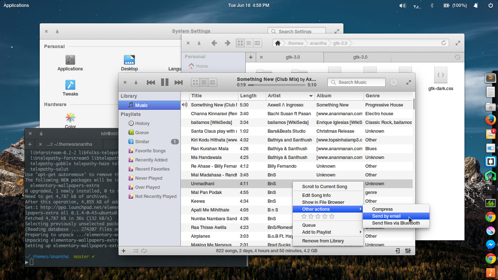

# anantha

"_anantha_" (infinities) is a gtk theme aimed for **elementary os** desktop (Freya) that deviates the default theme to the '_mac-side_' a bit, but just enough to be refreshing.

## Installation

Clone (or download the [zip](https://github.com/NirmalL/anantha/archive/master.zip)) and unzip it into `.themes` in your home and rename the theme folder to `anantha` (if necessary) so that it is `~/.themes/anantha`.

Now you need a tool like _elementary tweaks_ to change (just) the gtk theme. Select 'Tweaks' in 'System Settings' and on the first tab, change the GTK theme to 'anantha'. Leave the other options for defaults ('elementary').

That's it. It should work now.

### For the best experience

- Pantheon desktop
- Gtk3 latest (elementary os parallel)
- _HelveticaNeue_ as system font and _Menlo_ or _Monaco_ as terminal font

Feel free to suggest design ideas and point-out issues :-)
